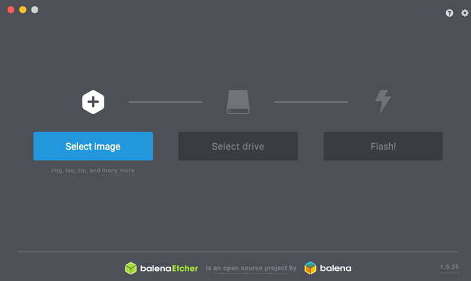

## Raspberry PI

- Formatting Mini SD Card
- Download belenaEtcher on your control computer -

Download your Rasbian image to "download" folder. (zip or tar) -

 

## Installtion of Blinkstick

- Description: USB Device which can indicate various changes in state based on internal processing within the application or infrastructure.bp

1. Installation (Performed via python-pip if not already installed)
   a. - sudo pip install blinkstick
   b. - sudo blinkstick --info (Provides information if hardware is visible)
   c. - echo "SUBSYSTEM==\"usb\", ATTR{idVendor}==\"20a0\", ATTR{idProduct}==\"41e5\", MODE:=\"0666\"" | sudo tee /etc/udev/rules.d/85-blinkstick.rules
   d. - sudo blinkstick --add-dev-rule

Step "c" and "d" allow blinkstick to execute without "sudo" permissions.
e. - sudo reboot (these values become active after reboot)
f. - blinkstick --morph --set-color=GREEN

(Note: step 'f' is to test the installation)

[back](./)
