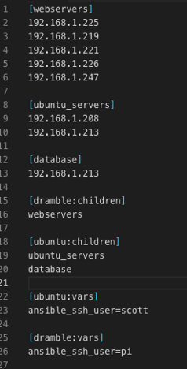
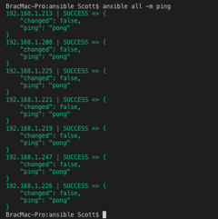
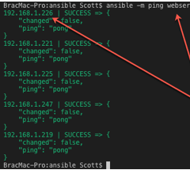
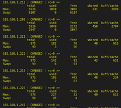
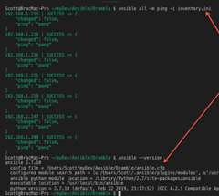
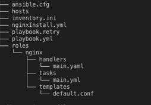

---
# Ansible Commands 
---

## Step 1: Once Installed - Configure Ansible Hosts & Groups (This is performed on your host computer)

\$sudo nano /etc/ansible/hosts

Groups:
webservers
ubuntu_servers
database

Variables:
Allows grouping for a single
ssh_user account.

    dramble:children
    ubuntu:children

## Step 2: Test Ansible Setup

Your Ansible setup is ready for testing. To test all hosts connectivity using ping module like:

- \$ansible -m ping all (Verifies connectivity to all devices)
- \$ansible -m ping webservers (Verificaton by device classification where webservers has been classified as a group of devices)
- \$ansible -m ping 192.168.1.226 (allows to test one address)

## Step 3: Verification of Shell Module

You can also run a command using shell module. For example, test the free memory on all servers or one. You can also perform the same task for a group. Just use group name instead of hostname.

- \$ ansible -m shell -a 'free -m' all

## Using External Inventory Files

Allows your inventory to be placed in a file called Inventory.ini and run via ansible command or playbook.

# Ansible Galaxy
Service to download unqique roles within Ansisble.

nginx installation

- ansible-galaxy install geerlingguy.nginx

loadbalancer using nginx

- ansible-galaxy install holms.balancer

For each specialty server, a unique role is established for tasks within a playbook.

That allows the playbook contain the minimum values in its file with values for handlers, tasks and templates needed.

## Listing Your Installed Roles

You can use the ansible-galaxy list command to list all the roles and role versions you have installed.
 - ansible-galaxy listInstalling Multiple Roles From a File

## Installing Multiple Roles From a File

Multiple roles can be installed by listing them in a requirements.yml file. The format of the file is YAML, and the file extension must be either .yml or .yaml.

Use the following command to install roles included in requirements.yml:

- $ ansible-galaxy install -r requirements.yml
